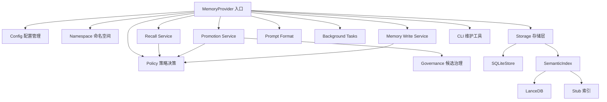

[文档首页](README.md) > 架构说明

# 架构说明

## 概述

Layered LanceDB SQLite Memory Provider 采用分层架构，将 SQLite 作为权威存储层，LanceDB 作为语义索引加速层。规范实现位于 `plugins/memory/layered_lancedb_sqlite/`；仓库根目录同名模块仅作为兼容 shim。

系统通过命名空间上下文（NamespaceContext）解析身份与作用域事实，通过集中化 Policy 控制 durable 写入、shared 授权、目标层与 principal 选择，通过 Governance 处理候选记忆提取、置信度和 supersession 启发式。

## 模块图

**模块说明**

- [MemoryProvider](modules/memory_provider.md) — 插件主入口，实现 Hermes MemoryProvider 接口，作为 adapter 协调各服务模块
- [Config](modules/config.md) — 配置管理，支持 YAML 配置文件和环境变量覆盖
- [Namespace](modules/namespace.md) — 命名空间解析，处理 Gateway 用户身份、workspace、profile、session 等上下文事实
- [Policy](modules/policy.md) — 集中化策略决策，处理 shared intent、durable 写入授权、目标层、principal 和召回 scope
- [Storage](modules/storage.md) — 存储层，SQLite 权威存储 + LanceDB 语义索引
- [Governance](modules/governance.md) — 候选治理，记忆分类、排序、指纹、取代关系判断
- [CLI](modules/cli.md) — 维护 CLI，提供验证和索引重建命令

## 分层结构

| 层级 | 职责 | 关键模块 |
|------|------|----------|
| 接口层 | 实现 Hermes MemoryProvider 钩子，对外提供服务 | [MemoryProvider](modules/memory_provider.md) |
| 协调层 | 解析命名空间、应用策略、委托服务 | [Namespace](modules/namespace.md)、[Policy](modules/policy.md) |
| 服务层 | 召回、升级、显式写入、格式化和后台任务 | Recall/Promotion/Memory Write/Prompt/Background modules |
| 治理层 | 候选提取、置信度、指纹、取代关系 | [Governance](modules/governance.md) |
| 存储层 | 持久化记忆记录、语义索引检索 | [Storage](modules/storage.md) |
| 配置层 | 加载配置、合并环境变量覆盖 | [Config](modules/config.md) |

## 数据流

### 记忆召回流程

1. `prefetch(query)` 接收查询文本
2. 解析当前命名空间上下文，确定 principal_id、workspace_id、session_id
3. Policy 构建显式、按顺序的 recall scopes
4. 查询 episodic 层（精确匹配当前 session）
5. 若为 Gateway 用户，查询 semantic_user 层（语义向量检索）
6. 查询 semantic_shared 层（语义向量检索）
7. 对语义命中记录执行 reinforce（增加 reinforcement_count）
8. 组装召回上下文，返回给 Hermes 智能体

### 记忆升级流程

1. `sync_turn(user, assistant)` 接收对话回合
2. 插入 episodic 记录（session-bound）
3. 异步执行 `_consolidate_turn`
4. `classify_turn` 分析用户输入，识别显式记忆请求或潜在事实
5. Policy 决定是否允许 durable 写入、目标语义层和目标 principal
6. 检查置信度阈值（promotion_min_score）
7. 查询现有语义记忆，检测重复或取代关系
8. 插入语义记忆记录，更新 LanceDB 索引
9. 低置信度记录自动归档（archive）

## 关键设计决策

- **SQLite 作为权威存储**：保证数据持久化和事务一致性，所有记忆记录首先写入 SQLite
- **LanceDB 可选依赖**：当 LanceDB 不可用时，回退到本地 JSON stub 索引，保持功能可用
- **Gateway 用户隔离**：Gateway 平台用户拥有独立的 semantic_user 层，非 Gateway 用户仅能访问 semantic_shared
- **Policy 集中化**：shared intent、shared 授权、durable target layer、principal 和 recall scope 均在 `policy.py` 中决策
- **Provider 拆薄**：Provider 保留 Hermes adapter 职责，召回、升级、显式写入、格式化和后台任务由服务模块承接
- **非主上下文权限控制**：agent_context="subagent" 的上下文默认禁止持久化语义记忆
- **异步升级**：记忆升级在后台线程池执行，不阻塞主对话流程

## 参见

- [API 参考](api.md)
- [数据模型](data_models.md)
- [开发指南](developer_guide.md)
